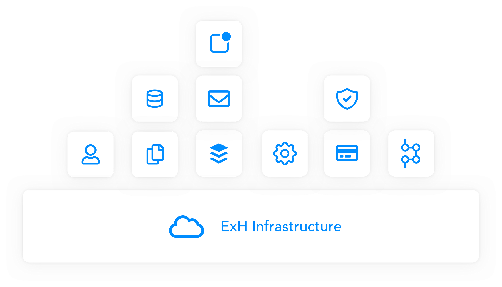

# Overview

## What is ExtraHorizon?

[ExtraHorizon](https://www.extrahorizon.com/medical-cloud-backend) is a medical Backend As A Service product that leverages existing cloud providers such as AWS, Google Cloud, Microsoft Azure to deliver an easy and fast roadmap towards fully certified and compliant cloud connected medical devices. Currently, Extra Horizon compatibility is optimised with AWS. Future clouds are on the roadmap.

ExtraHorizon exists of a set of web services that the customer can use to compose a custom backend specific to their needs.

## A dedicated backend for your medical application

Every ExtraHorizon environment is deployed on dedicated cloud resources. There is **no infrastructure sharing between customers!** Each cluster has an ExtraHorizon infrastructure layer on which a set of modules can be deployed. You can access your deployment through a tailored API. Each of these modules are built according to IEC62304 standards and meet regulatory compliance.

## Available Modules

To get a general overview of the different modules that can be used on ExtraHorizon, take a look at [this page.](https://www.extrahorizon.com/cloud-services)

## Where to get additional support?

**Support questions?** Reach out to our support team via [requests@extrahorizon.com](mailto:requests@extrahorizon.com) 

**General questions?** Fill in [the form on our website](https://www.extrahorizon.com/contact) and we'll get in touch with you asap

