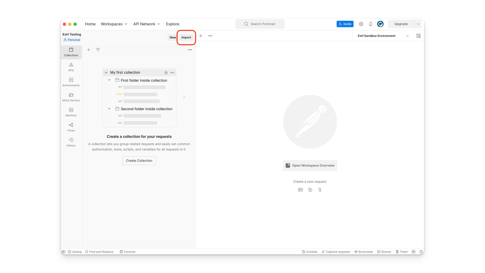
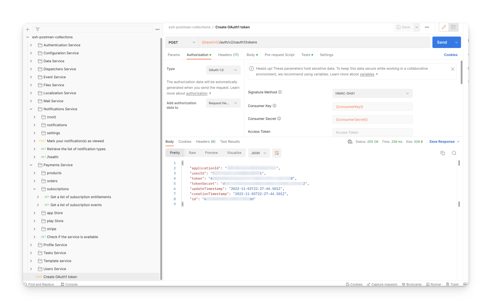

# Postman Reference Collection

For your convenience we also provide the API specification as a Postman collection, to interact quickly and easily with the API.

You can download the collection here



## How to use the Postman Collection

<figure><figcaption>
Import collections in Postman
</figcaption></figure>

### Step 1: Import the collection in Postman

1. Open Postman and click on the "Import" button
2. Select the `exh-postman-collections.json` from your filesystem
3. Confirm the import by clicking the orange "Import" button
4. The Extra Horizon postman collection is now available

### Step 2: Create a Postman environment that stores your credentials

The Extra Horizon API offers oAuth1 and oAuth2 authenthication mechanisms. The Postman collection contains some logic to facilicate using the endpoints.

Create a new Postman environment that contains the following variables:&#x20;

<table><thead><tr><th width="238"></th><th>Value</th></tr></thead><tbody><tr><td><code>baseUrl</code></td><td><code>https://api.dev.exh-sandbox.extrahorizon.io</code></td></tr><tr><td><code>consumerKey</code></td><td>27a4353c3a950a494a6fd58a6g3c0cff4affc953</td></tr><tr><td><code>consumerSecret</code></td><td>7470a5bc2d42346988c5418420ac27cfe6ae5e8b</td></tr><tr><td><code>email</code></td><td><code>john.doe@extrahorizon.com</code></td></tr><tr><td><code>password</code></td><td><code>SomeVeryDifficultP@ss</code></td></tr></tbody></table>

**Don't forget to save the environment!**

<figure><figcaption>
Environment view in Postman
</figcaption></figure>

After creating the environment, make sure it is selected in the top-right dropdown before continuing.


To learn more how to manage different environments, take a look at the [Postman Documentation on Environments](https://learning.postman.com/docs/sending-requests/managing-environments/).


### Step 3: Execute the authentication call

Open and execute the `Create OAuth1 token` HTTP Request. If all environment variables are set correctly, this call will return successfully a `token` and `tokenSecret` that you should use in subsequent requests.&#x20;

<figure><figcaption></figcaption></figure>

The `token` and `tokenSecret` variables are automatically stored in the environment. Other requests reference to these variables.&#x20;

