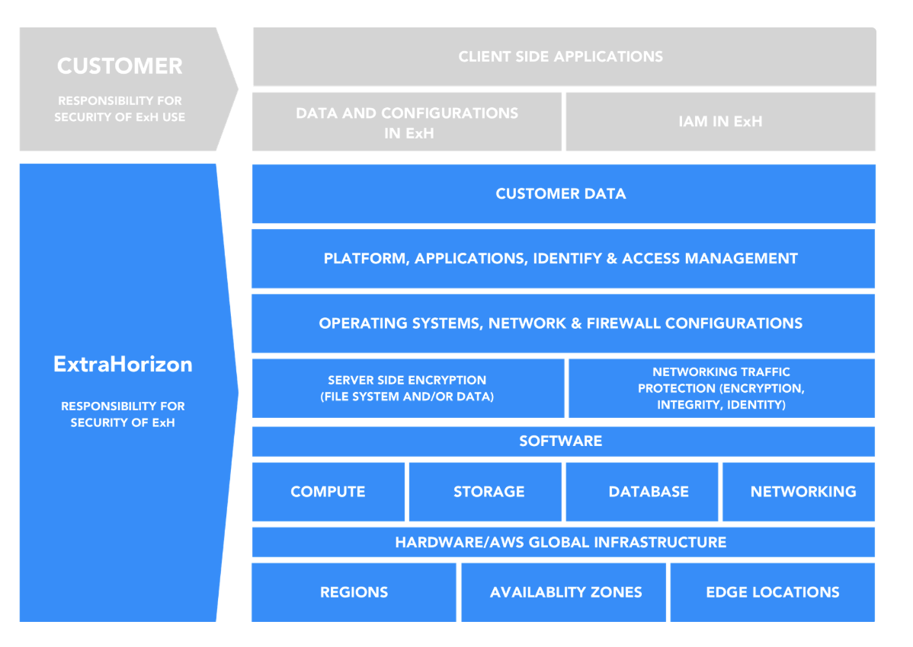

# 🤝 Shared Responsibility Model

<figure><figcaption></figcaption></figure>

## Overview 

Quality, Security & Privacy or end appliations is a shared responsibility between Extra Horizon and the customer. This shared model can help relieve the customer’s operational burden as Extra Horizon fully operates, manages and controls the components from the host operating systems and virtualization layer down to the physical security of the facilities in which the services operates.

The customer assumes responsibility and management of the data, the identity and access and other configurations within Extra Horizon.

Customers should carefully consider the ExH services they choose and the location where their ExH clusters operates as they are responsible for the applicable laws and regulations of their applications.



### **ExH responsibility of “Security of ExH”**  

ExtraHorizon is responsible for protecting the infrastructure and systems that runs all of the services offered in the ExH Cluster as well as the services themselves. This infrastructure is composed of the hardware, software, networking, and facilities that run ExH Clusters.

ExH will be responsible for the management of software systems (e.g. software updates and security patches), networking configurations of the underlying ExH system.



### **Customer responsibility “Security in ExH”** 

For all ExtraHorizon services, ExH operates the infrastructure layer, the operating system, and platforms, and customers access the endpoints to store and retrieve data.

Customers are responsible for managing their data, classifying their assets, and using IAM tools to apply the appropriate permissions.




This customer/ExH shared responsibility model also extends to IT controls. Customers can then use the ExH control and compliance documentation available to them to perform their control evaluation and verification procedures as required. Below are examples of controls that are managed by AWS, AWS Customers and/or both.

**Inherited Controls** – Controls which a customer fully inherits from EXH.

* Physical and Environmental controls

**Shared Controls** – Controls which apply to both the infrastructure layer and customer layers, but in completely separate contexts or perspectives. In a shared control, ExH provides the requirements for the infrastructure and the customer must provide their own control implementation within their use of ExH services. Examples include:

* Patch Management – ExH is responsible for patching and fixing flaws within the infrastructure and services, but customers are responsible for patching configurations (Functions, Templates, ...) they deploy in ExH Services.
* Configuration Management – ExH maintains the configuration of its infrastructure devices, but a customer is responsible for configuring their own ExH Services.
* Awareness & Training - ExH trains ExH employees, but a customer must train their own employees.

**Customer Specific** – Controls which are solely the responsibility of the customer based on the application they are developing on top of ExH services. Examples include:

* Regulations (GDPR,…), application specific consent management, …
