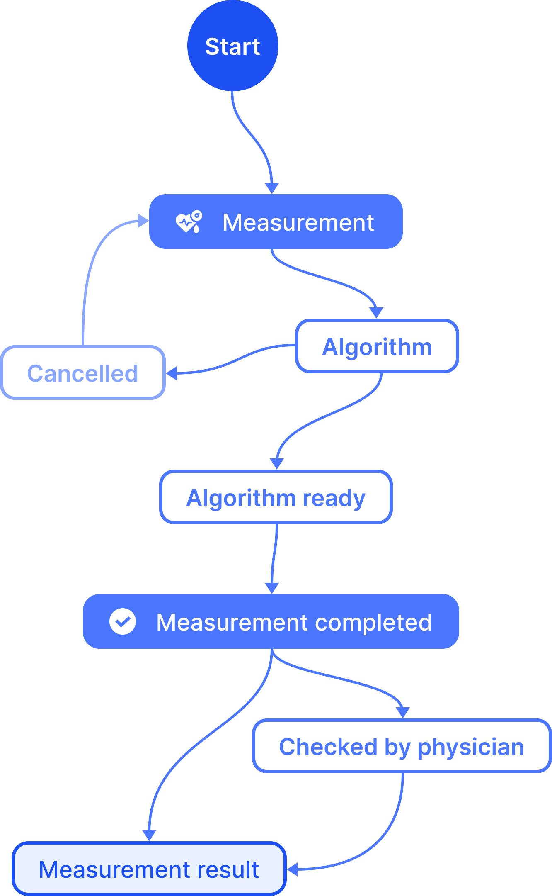
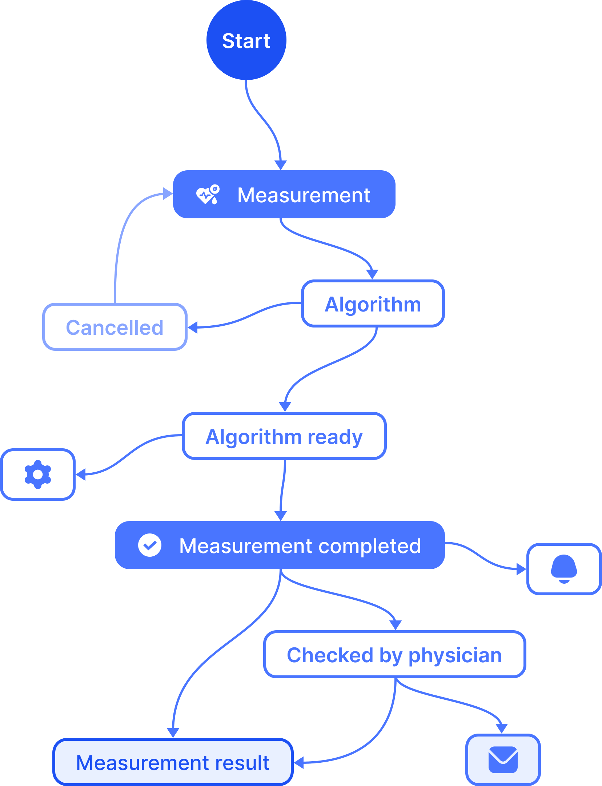

# Data Service

## **Intro** 

Data is managed using structured documents, written in JSON. These documents rely on data schemas which determine the structure, behaviour, and logic of the documents in a schema collection. The purpose of a data schema is twofold:

1. **Define Data structure** Data Schemas define the structure of a document using properties. This ensures uniform structuring of documents across the service and provides input validation for API interactions. Data structure definitions in schemas are inspired by [JSON-schemas](http://json-schema.org/) and adhere to the same syntax.
2. **Define behavioural logic** Data Schemas define the behavioural logic of a document using states and transitions. When a document transitions from one status to another, actions are triggered such as sending an email or running a small piece of code in other services.


ExH Explainer - Data Service Basics


### Data Structure 

Schema validation is based on the open-source JSON schema specification. This allows you to create complex data structures that you can configure yourself. Besides defining field types, you can create complex fields with constraints like: minimum, maximum, regex, maxItems, minItems, …

### States & Transitions 

The document service allows you to configure workflows that match your exact business need. You can mark your documents with specific states and create transitions between these states, these can be manual or automatic.For example, you can create an order and shipment workflow to keep track of all orders, connect your frontend applications, and trigger actions to inform stakeholders when needed.

### Conditions & Actions 

You can add conditions to a transition, meaning the transition can only be executed if all the conditions are met. E.g. you can make automated transitions only trigger under specific circumstances. (Field value, the person executing the transition, …)When a transition does trigger you can attach actions. These actions can range from sending events, sending text messages, push notifications, email, starting a script and so much more…

