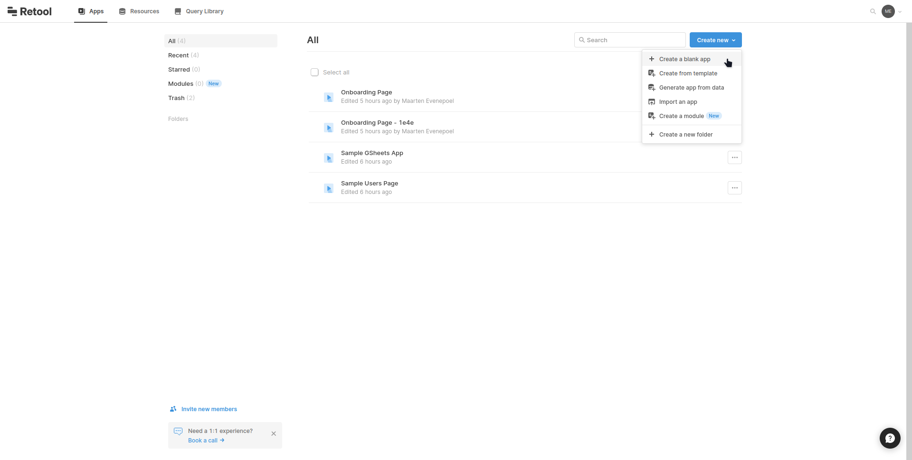
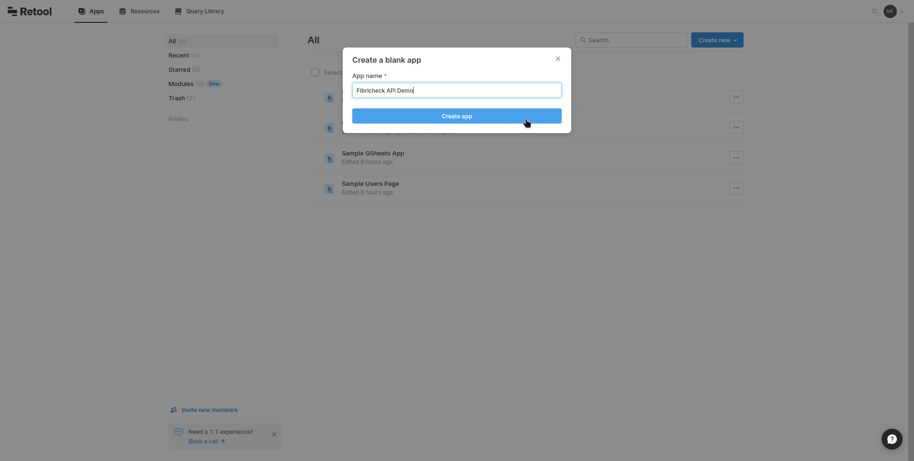
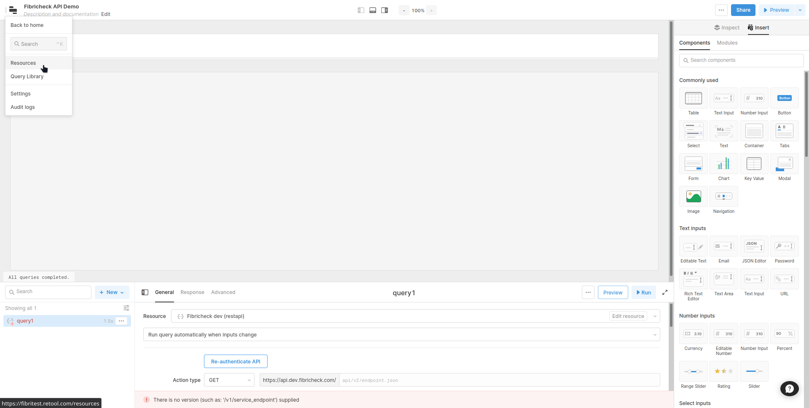
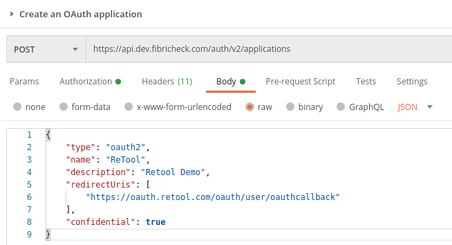
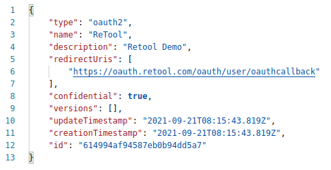
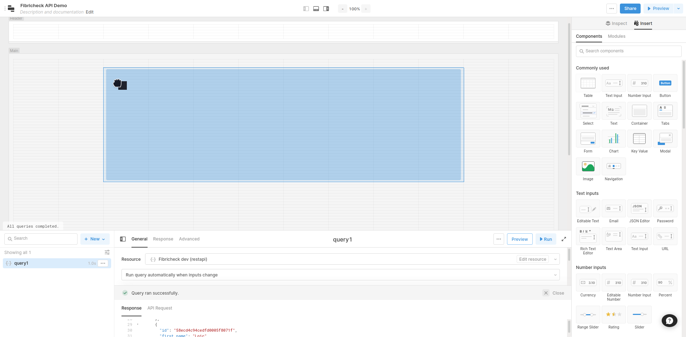
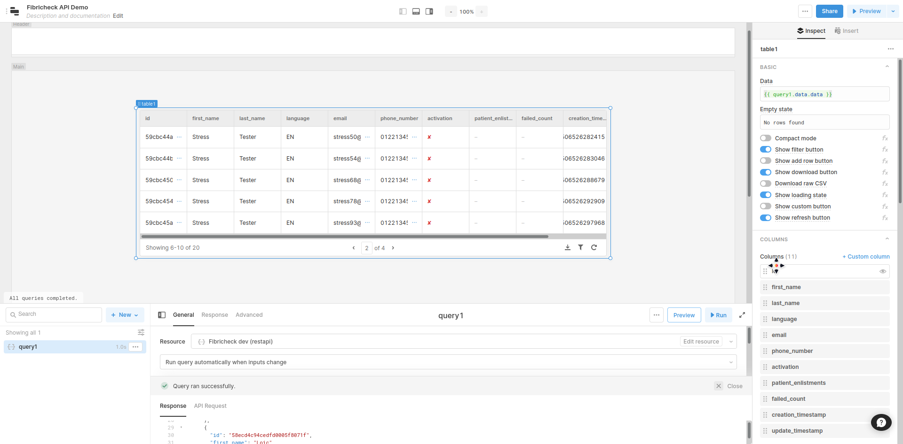
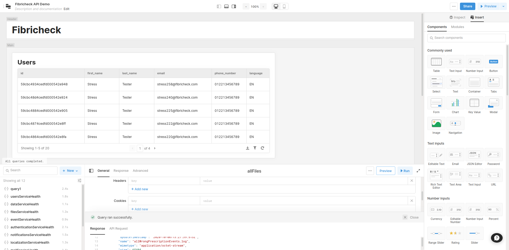
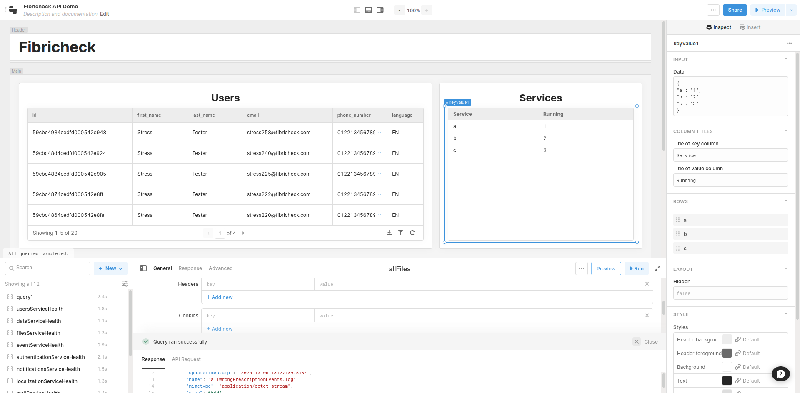
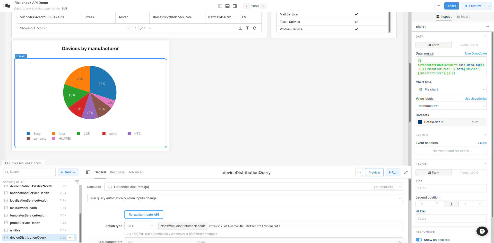

# Building dashboards with Retool

This document serves as a guide and proof-of-concept on how Retool can be used to quickly build simple dashboards with data pulled from the Extra Horizon API. To demonstrate this, this guide will describe how to connect the FibriCheck development API to Retool as a resource, how to pull data into Retool from the API, and how to build simple visualizations with the data.

### Creating a Retool application <a href="creating-a-retool-application" id="creating-a-retool-application"></a>

First off, we need to create a Retool application. Once you’re logged into retool, click on the `create new` button in the top right of the screen and select `Create a blank application`.



Pick a name for your application and click `create app`. This will create a blank application from which we can start building.



### Connecting the Extra Horizon API to Retool as a resource <a href="connecting-the-extrahorizon-api-to-retool-as-a-resource" id="connecting-the-extrahorizon-api-to-retool-as-a-resource"></a>

In order to be able to fetch data from the Extra Horizon API we’ll need to set it up as a resource within Retool. To do this, click the menu button in the top left of the screen and click on `Resources`.



Next, click on `create new` to create a new resource.


Here you can select what type of resource you want to add. Retool supports a wide range of data sources. We’ll want to use the Extra Horizon API as a data source, so we’ll select `Rest API` under `API's`.


Up next, we can configure our resource further.

Enter a name for your resource to reference later in the UI builder. Now, enter the Base URL of the Extra Horizon API you will be using. For this guide, we’ll be using `https://api.dev.fibricheck.com`.


#### Authentication <a href="authentication" id="authentication"></a>

In order to fetch data at the API, we’ll need some form of authentication. Retool supports both OAuth1 and OAuth2. However, because Retool supports a one-legged version of OAuth1 and the Extra Horizon API only support three-legged OAuth1 we cannot use OAuth1 for authentication. OAuth2 would be an alternative option. However, the Extra Horizon API supports only the refresh token grant type and the password grant type, which Retool in turn does not support since Retool only supports the client credentials grant type.

Luckily, there is a way around this authentication problem which enables us to setup the authentication for demonstration purposes.

First off, under the `Headers` setting of our resource, set `Authorization` as `Bearer OAUTH2_TOKEN`. The `OAUTH2_TOKEN` string is a placeholder to inform retool where to place the OAuth2 access token in the API request (see previous screenshot).

Next, we’ll set the `Authentication` setting to `Custom Auth`. In order to be able to further configure our authentication scheme, we’ll first want to add Retool as a new OAuth2 application in the Extra Horizon API and getting all the relevant tokens from the API to enter into Retool.

To do this, we’ll make the following request using Postman (we’ll be assuming you’re already able to make authenticated requests to your API). Under `type`, enter `oauth2`. You can then pick a name and description for your OAuth2 application. Under `redirectUris` enter `https://oauth.retool.com/oauth/user/oauthcallback`. This is the callback URI that is provided by Retool in the resource setup page we were on earlier.



Which, if successful, should return the following:



Then in order to receive a ClientID and ClientSecret for our application, we’ll need to add a version to our application. This can be done with the following request. Not that we’re using the `id` we received in the previous response to form the request URL. The version value van be anything you like.


Which should then provide us with the ClientID and ClientSecret.

Lastly, we’ll need to generate an access token and a refresh token. We’ll make a request to the `/auth/v2/oauth2/tokens` endpoint to generate the tokens. For this request we’ll use the password grant type. The request looks as follows:


The Authorization of the request must be set to Basic Auth, using your ClientID and ClientSecret as credentials. The Authorization should look as follows:


If all went well, the request should return a response containing an access token and a refresh token. We can now use these tokens in our Authorization configuration in Retool.

Back in our Resource configuration in Retool we set `Authorization` to `Custom Auth`. Here we can define a custom Authentication flow by manually adding steps to the flow. Click `Add new step to the auth workflow` and select `API Request` from the drop down.


The Basic header string can be extracted from our previous Postman request, as shown here:


The refresh token is the refresh token we received earlier.

Next add a new step to store our access token into the OAUTH2\_TOKEN environment variable of Retool.

.png>)

To finish of, we’ll test our configuration by clicking the `Test auth workflow` and `Test refresh auth workflow` buttons. If all went well, we should be all set to start building our actual application.

### Building an interface <a href="building-an-interface" id="building-an-interface"></a>

Let’s return to our UI building interface. We’ll start by building a table of all our users. To do this, we will first fetch the necessary data. At the bottom of the interface you’ll find a window where you can form a request to the API.

Under `Resource`, we’ll select `FibriCheck dev (restapi)` since that is the resource we’ve setup earlier.

Under `Action type` we'll select a GET request, and we'll specify the endpoint as `users/v1/`, since that contains the information we want to display. We can now click the blue `Run` button in the top right corner to execute our query.

.png>)

Now that we've made our query, we can add a table into our UI. We can do this by dragging a table element from the components tab on the right to our "worksheet".



The cool thing is that if you drag a table onto the worksheet after making a query earlier, Retool will automatically try to fill in the response data from that request into a table element. Our resulting table containing elements from the FibriCheck development environment looks something like this:



Let's clean up our table a little. We can select which columns should be shown by disabling a columns visibility in the `columns` panel panel to the right of the interface. We can also re-order our columns in the same panel.


You can play around a little with the layout and looks to make it look the way you like. I placed the table and a title together in a container to create a neat little component. I also added a page title. Note: When writing labels or anything in else in text format, you can use both markdown and HTML notation to add some quick markup to the text you're writing.



Let's now also add a key-value table to show if a service in the API is up and running by querying the health endpoint of each service. To do this we'll add a key-value table, along with a title to a new component and add them next to our \`Users\` component.



Now we need to know if each service is actually up and running by checking the \`/health\` endpoint of each service. To do this we can craft a request as follows:


We can now make an analogous request for other services as well. Now we can edit the data field of our key-value table to contain the following:

```
{
    "User Service": {{ usersServiceHealth.data.message == ""}},
    "Data Service": {{ dataServiceHealth.data.message == "" }},
    "Files Service": {{ filesServiceHealth.data.message == "" }},
    "Event Service": {{ eventServiceHealth.data.message == "" }},
    "Authentication Service": {{ authenticationServiceHealth.data.message == "" }},
    "Notifications Service": {{ notificationsServiceHealth.data.message == "" }},
    "Localizations Service": {{ localizationServiceHealth.data.message == "" }},
    "Mail Service": {{ mailServiceHealth.data.message == "" }},
    "Tasks Service": {{ templatesServiceHealth.data.message == "" }},
    "Profiles Service": {{ templatesServiceHealth.data.message == ""}}
}
```

The snippet above creates a record in the key-value table for each service. The value part of the record (between {{ }} brackets) is a JavaScript snippet that accesses the message field of the data object on the requests response. If a request is successful, this field will be empty and the expression will evaluate to `true`. In all other cases, the expression in {{ }} brackets will evaluate to `false`. Retool will then in turn display an appropriate icon for `true` and `false` evaluations accordingly in the table.


To finish designing our demonstration dashboard. We will add a more graphical representation of the data in the form of a pie chart. We'll display the distribution of mobile devices used to make measurements for a given schema ID. The request to the API looks as follows:


This request returns an array of data with objects with the following schema:

```
"data": [
    {
        "id": "5812345746e0fb0005550e54",
        "creatorId": "5811c91b46e0fb000530a46d",
        "userIds": [
            "5811c91b46e0fb000530a46d"
        ],
        "groupIds": [
            "5811be2446e0fb000530a45f"
        ],
        "status": "reviewed",
        "data": 
        {
            "heartrate": 57,
            "measurement_timestamp": 1477587992648.361,
            "location": {
                "longitude": 5.352118,
                "latitude": 50.95165
            },
            "app": {
                "version": "1.0.4(17)"
            },
            "abnormalities": [],
            "device": {
                "manufacturer": "apple",
                "os": "10.0.2",
                "model": "iPhone",
                "type": "ios"
            },
            "af": 0.23529411764705888,
            "indicator": "normal",
            "context": {
                "stress": 5,
                "symptoms": [
                    "lightheaded"
                ]
            },
            "diagnosis": {
                "text": "",
                "label": [
                    "sinus"
                ]
            },
            "extractionStatus": "finished",
            "extractionStatusChangedTime": 1554116958584,
            "extractedFileToken": "5ca1f15d3492271c035a828f-e2fdba82-902f-4ebe-8c5d-a0e539da769c"
        },
        "statusChangedTimestamp": "2016-11-21T18:14:56.515Z",
        "updateTimestamp": "2019-04-01T11:09:18.732Z",
        "creationTimestamp": "2016-10-27T17:07:35.126Z"
    },
    ...
]
```

From this, we want to collect the data from the `manufacturer` field in each `device` object contained in all objects in the main data array. Then we want to sum all occurrences of the same manufacturers and display the amount each manufacturer appears proportionally in a pie chart.

To do this in Retool, we'll first drag a `chart` component onto the worksheet. In the settings of our chart, we'll set `Chart type` to `Pie chart`. In the `Data source` field, we'll enter the following JavaScript snippet:

```
{{ 
    deviceDistributionQuery.data.data.map(x => (
      {"manufacturer": x.data["device"]["manufacturer"]}
    ))
}}
```

What this snippet does is it maps all objects in the data array found in the API response and creates a new array by mapping all device manufacturer fields in the data array to new objects containing only the manufacturer information. More concretely, the snippet will transform the data array to an array that looks as follows:

```
[
    { "manufacturer": "apple" },
    { "manufacturer": "Acer" },
    { "manufacturer": "Acer" },
    { "manufacturer": "Acer" },
    { "manufacturer": "Acer" },
    { "manufacturer": "HTC" },
    { "manufacturer": "HTC" },
    { "manufacturer": "samsung" },
    { "manufacturer": "HUAWEI" },
    { "manufacturer": "Sony" },
    { "manufacturer": "Sony" },
    { "manufacturer": "Sony" },
    { "manufacturer": "Sony" },
    { "manufacturer": "Sony" },
    { "manufacturer": "Sony" },
    { "manufacturer": "apple" },
    { "manufacturer": "samsung" },
    { "manufacturer": "LGE" },
    { "manufacturer": "LGE" },
    { "manufacturer": "LGE" }
]
```

Next, under `value labels` select `manufacturer` so Retool knows to create labels for each manufacturer. Lastly, under `Datasets` click `+ New` to create a new dataset. Retool should automatically have created a new `Dataseries 1` object which contains the information we would like to display in our pie chart. If Retool did not automatically select an aggregation method for this new Dataseries, you can set it yourself to `Sum`. This should sum all occurrences of each manufacturer.

Our final configuration should give us the following pie chart:



### Conclusion <a href="conclusion" id="conclusion"></a>

This section concludes the integration guide showing the basics of building visualizations for Extra Horizon API’s with Retool. For a more comprehensive guide on working with Retool, we advise you to read the [Retool documentation.](https://docs.retool.com/docs/whats-retool)
