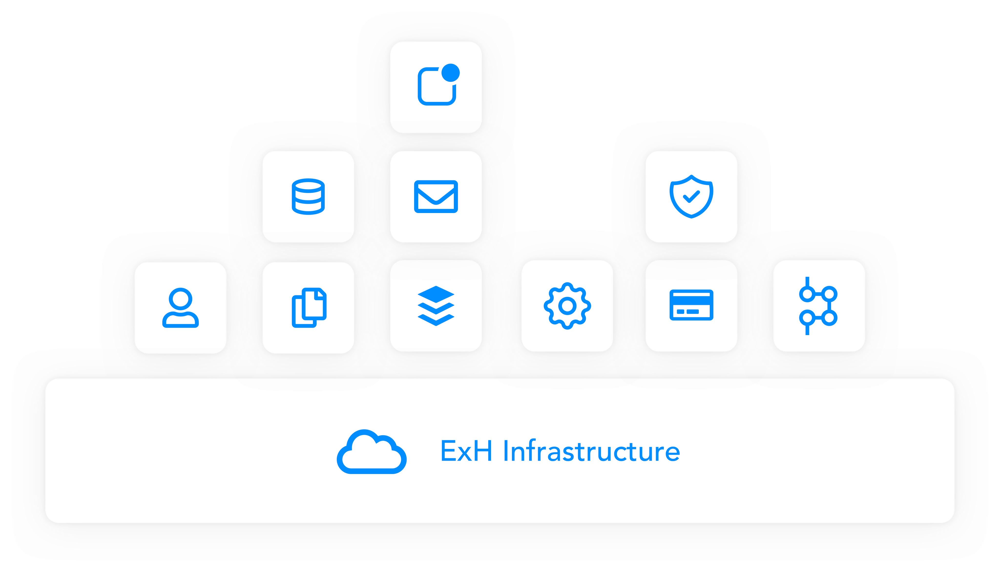

# Service Documentation

## Intro

ExtraHorizon exists of a set of web services that the customer can use to compose a custom backend specific to their needs and specifications.

Each customer can have one or more dedicated clusters. Each cluster has a basic ExtraHorizon infrastructure layer where additional services can be installed.

## IAM - Identity & Access Management

IAM or identity and access management is at the center of each ExtraHorzion setup. This is the place where you can manage and create users, groups, define roles and allocate permissions, manage security settings such as 2FA and much more…

### Authentication Service

The authentication service main responsibility is authenticating each incoming request and attaching an identity to that request.

The service supports multiple authentication mechanisms such as oAuth1.0, oAuth2.0, SSO, MFA,… You can register frontend applications and determine it's accessible functionality.


[authentication.md](authentication.md)


### User Service

The user service is responsible for managing identities in an ExtraHorizon Cluster. Each action you take always occurs in the context of such an identity.

The service has functionality ranging from registering new identities, managing roles, permissions, password management, etc…


[user-service.md](user-service.md)


## Storage

### Data Service

The data service is a service that provides storage and query capabilities.

The service allows you to: define you own queryable data models by utilizing JSON Schema’s, define workflows that can trigger other services or automation rules in the network. The data service like all other services support an extremely flexible querying language in the form of querying parameters.


[data-service.md](data-service.md)


### File Service

The file service provides storage for non queryable data such as images, video, raw ECG signals, etc. And in combination with the document service the combination can be made to accommodate for any storage need a customer might have.


[file-service.md](file-service.md)


## Automation

### Task Service

The task service is the glue between al our services. Every client as specific business logic that needs to be implemented. Whether it ranges from sending an email when a person registers or sending a Text message when you have ordered a new product.

By using the ExtraHorizon SDK you can write very small and simple scripts in a range of languages (Node. **js**, **Python**, **Java**, **Ruby**, C#, Go and **PowerShell**)

### Webhook Service

Planned for end of 2021

The web hook service allows you to take action when a web hook is trigger from the outside or when you want to create a web hook that can be consumed by another application.

This service is planned for development towards the end of 2021

### Event Service

The event service is the backbone of an ExtraHorizon cluster. Each action you take in a service will also trigger an event. This service services acts as the central message broker throughout the system.

You link events to other services or use e.g. a task to execute a small piece of code to take care of some specific business logic.

## Communication

### SMS Service

Planned for Q4 of 2021

Want to keep your customers or clients up to date about their latest diagnostic report or send them an invite over Text Message? This service allows you to send any kind Text message to your registered users.

#### Mail Service

The mail service allows you to send mails to your registered identities

### Notification Service

Send push notifications to android and iOS.

### Localization Service

Translations of documents in you cloud or of email and notifications can be handled by the localization service.

## Other Services

### Payment Service

Make an easy process of integration any payment system. Apple IAP, Google Pay, Stripe.

### Template Service

Make good looking html templates for Emails or make detailed pdf reports for medical user.
